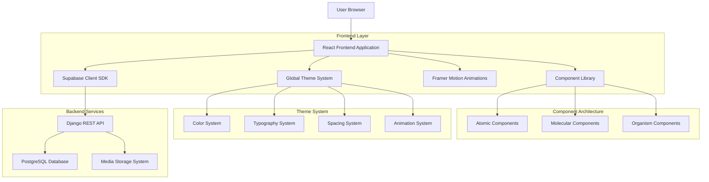

# Technical Architecture Document - Premium IVF Website Redesign

## 1. Architecture Design



## 2. Technology Description

### Frontend Stack
- **Framework**: React@18 with Hooks and Context API
- **Styling**: Tailwind CSS@3 with custom configuration
- **Animations**: Framer Motion@10 for advanced animations
- **State Management**: React Context + useReducer for global state
- **Routing**: React Router@6 for client-side routing
- **HTTP Client**: Axios for API communication
- **Icons**: Heroicons and custom SVG icons
- **Forms**: React Hook Form with validation

### Backend Stack
- **Framework**: Django REST Framework@3.14
- **Database**: PostgreSQL@14 with optimized queries
- **Media Storage**: Local file system with CDN integration ready
- **Authentication**: Token-based authentication
- **API Documentation**: Auto-generated DRF documentation

### Development Tools
- **Initialization Tool**: vite-init (Vite@4 for fast development)
- **Package Manager**: npm@9
- **Code Quality**: ESLint@8 with React hooks rules
- **Testing**: Jest@29 with React Testing Library

## 3. Route Definitions

| Route | Purpose | Component | Data Requirements |
|-------|---------|-----------|-------------------|
| `/` | Homepage with hero, doctors, services | Home.jsx | Slides, doctors, services |
| `/about` | About Us page | About.jsx | Static content, team info |
| `/services` | Services listing page | Services.jsx | All services with descriptions |
| `/services/:slug` | Individual service detail | ServiceDetail.jsx | Service details, related services |
| `/team` | Team/Doctors page | Team.jsx | All doctors with profiles |
| `/media-coverage` | Media coverage page | MediaCoverage.jsx | Media items, categories |
| `/success-stories` | Patient testimonials | SuccessStories.jsx | Success stories with images |
| `/blog` | Blog listing page | Blog.jsx | Blog posts with excerpts |
| `/blog/:slug` | Individual blog post | BlogPost.jsx | Full blog content, related posts |
| `/contact` | Contact page with form | ContactUs.jsx | Contact info, form handling |
| `/book-consultation` | Appointment booking | BookConsultation.jsx | Form validation, submission |

## 4. Component Architecture

### 4.1 Atomic Components (Atoms)
```javascript
// Button Component
const Button = ({ variant, size, children, onClick, ...props }) => {
  const baseClasses = "font-medium rounded-lg transition-all duration-300";
  const variants = {
    primary: "bg-gradient-to-r from-primary-blue to-primary-darkBlue text-white hover:shadow-lg",
    secondary: "border-2 border-primary-pink text-primary-pink hover:bg-primary-pink hover:text-white",
    outline: "border border-gray-300 text-gray-700 hover:bg-gray-50"
  };
  
  return (
    <button className={`${baseClasses} ${variants[variant]} ${sizeClasses[size]}`} {...props}>
      {children}
    </button>
  );
};

// Input Component
const Input = ({ type, placeholder, value, onChange, error, ...props }) => {
  return (
    <div className="relative">
      <input
        type={type}
        placeholder={placeholder}
        value={value}
        onChange={onChange}
        className={`w-full px-4 py-3 rounded-lg border ${error ? 'border-red-500' : 'border-gray-300'} focus:outline-none focus:ring-2 focus:ring-primary-blue`}
        {...props}
      />
      {error && <span className="text-red-500 text-sm mt-1">{error}</span>}
    </div>
  );
};
```

### 4.2 Molecular Components (Molecules)
```javascript
// Service Card Component
const ServiceCard = ({ service, onClick }) => {
  return (
    <motion.div
      whileHover={{ y: -8, boxShadow: "0 40px 80px rgba(0, 102, 255, 0.15)" }}
      className="bg-gradient-to-br from-white to-gray-50 rounded-2xl p-8 shadow-lg border border-blue-100"
    >
      <div className="flex items-start space-x-6">
        <div className="w-20 h-20 rounded-full bg-gradient-to-br from-primary-blue to-primary-pink flex items-center justify-center">
          <MedicalIcon className="w-10 h-10 text-white" />
        </div>
        <div className="flex-1">
          <h3 className="text-2xl font-bold text-gray-900 mb-3">{service.title}</h3>
          <p className="text-gray-600 mb-4 leading-relaxed">{service.short_description}</p>
          <Button variant="primary" onClick={onClick}>
            Learn More
            <ArrowRightIcon className="w-4 h-4 ml-2" />
          </Button>
        </div>
      </div>
    </motion.div>
  );
};

// Doctor Profile Card
const DoctorCard = ({ doctor }) => {
  return (
    <div className="bg-white rounded-2xl shadow-xl overflow-hidden transform hover:scale-105 transition-transform duration-300">
      <div className="relative">
        
        <div className="absolute inset-0 bg-gradient-to-t from-black/50 to-transparent" />
        <div className="absolute bottom-4 left-4 text-white">
          <h3 className="text-xl font-bold">{doctor.name}</h3>
          <p className="text-sm opacity-90">{doctor.specialty}</p>
        </div>
      </div>
      <div className="p-6">
        <div className="mb-4">
          <h4 className="font-semibold text-gray-900 mb-2">Qualifications</h4>
          <p className="text-gray-600 text-sm">{doctor.qualifications}</p>
        </div>
        <div className="mb-4">
          <h4 className="font-semibold text-gray-900 mb-2">Experience</h4>
          <p className="text-gray-600 text-sm">{doctor.experience} years</p>
        </div>
        <Button variant="outline" className="w-full">
          View Full Profile
        </Button>
      </div>
    </div>
  );
};
```

### 4.3 Organism Components (Organisms)
```javascript
// Homepage Hero Section
const HeroSection = ({ slides }) => {
  const [currentSlide, setCurrentSlide] = useState(0);
  
  return (
    <section className="relative h-screen overflow-hidden">
      <AnimatePresence mode="wait">
        {slides.map((slide, index) => (
          index === currentSlide && (
            <motion.div
              key={slide.id}
              initial={{ opacity: 0, scale: 1.1 }}
              animate={{ opacity: 1, scale: 1 }}
              exit={{ opacity: 0, scale: 0.9 }}
              transition={{ duration: 0.8, ease: "easeInOut" }}
              className="absolute inset-0"
            >
              <div className="absolute inset-0 bg-gradient-to-r from-black/50 to-transparent z-10" />
              
              <div className="absolute inset-0 flex items-center z-20">
                <div className="container mx-auto px-4">
                  <motion.div
                    initial={{ y: 50, opacity: 0 }}
                    animate={{ y: 0, opacity: 1 }}
                    transition={{ delay: 0.3, duration: 0.6 }}
                    className="max-w-2xl text-white"
                  >
                    <h1 className="text-5xl md:text-7xl font-bold mb-6">
                      {slide.title}
                    </h1>
                    <p className="text-xl md:text-2xl mb-8 opacity-90">
                      {slide.subtitle}
                    </p>
                    {slide.button_text && (
                      <Button variant="primary" size="lg">
                        {slide.button_text}
                      </Button>
                    )}
                  </motion.div>
                </div>
              </div>
            </motion.div>
          )
        ))}
      </AnimatePresence>
      
      {/* Navigation dots */}
      <div className="absolute bottom-8 left-1/2 transform -translate-x-1/2 flex space-x-3 z-30">
        {slides.map((_, index) => (
          <button
            key={index}
            onClick={() => setCurrentSlide(index)}
            className={`w-3 h-3 rounded-full transition-all duration-300 ${
              index === currentSlide ? 'bg-white scale-125' : 'bg-white/50'
            }`}
          />
        ))}
      </div>
    </section>
  );
};
```

## 5. Global Theme System Implementation

### 5.1 Enhanced Theme Configuration
```javascript
// theme/theme.js - Enhanced version
export const theme = {
  // Premium Color Palette
  colors: {
    primary: {
      blue: '#0066FF',
      darkBlue: '#0047AB',
      lightBlue: '#4D9FFF',
      pink: '#FF1493',
      darkPink: '#C71585',
      accent: '#00D4FF',
      gold: '#FFD700',
    },
    secondary: {
      pearl: '#F8F9FA',
      mist: '#E8F4F8',
      blush: '#FFE4E1',
      lavender: '#E6E6FA',
      cream: '#FFF8E7',
    },
    neutral: {
      white: '#FFFFFF',
      lightGray: '#F5F5F5',
      gray: '#6B7280',
      darkGray: '#374151',
      black: '#1F2937',
    },
    semantic: {
      success: '#10B981',
      warning: '#F59E0B',
      error: '#EF4444',
      info: '#3B82F6',
    }
  },
  
  // Typography System
  typography: {
    fontFamily: {
      primary: "'Inter', -apple-system, BlinkMacSystemFont, 'Segoe UI', sans-serif",
      secondary: "'Source Sans Pro', -apple-system, BlinkMacSystemFont, 'Segoe UI', sans-serif",
    },
    fontSize: {
      xs: '0.75rem',
      sm: '0.875rem',
      base: '1rem',
      lg: '1.125rem',
      xl: '1.25rem',
      '2xl': '1.5rem',
      '3xl': '1.875rem',
      '4xl': '2.25rem',
      '5xl': '3rem',
      '6xl': '3.75rem',
      '7xl': '4.5rem',
    },
    fontWeight: {
      light: 300,
      normal: 400,
      medium: 500,
      semibold: 600,
      bold: 700,
      extrabold: 800,
    },
    lineHeight: {
      tight: 1.25,
      normal: 1.5,
      relaxed: 1.75,
    },
  },
  
  // Spacing System
  spacing: {
    xs: '0.25rem',
    sm: '0.5rem',
    md: '1rem',
    lg: '1.5rem',
    xl: '2rem',
    '2xl': '3rem',
    '3xl': '4rem',
    '4xl': '6rem',
    '5xl': '8rem',
  },
  
  // Border Radius
  borderRadius: {
    none: '0',
    sm: '0.125rem',
    md: '0.375rem',
    lg: '0.5rem',
    xl: '0.75rem',
    '2xl': '1rem',
    '3xl': '1.5rem',
    full: '9999px',
  },
  
  // Shadows
  shadows: {
    sm: '0 1px 2px 0 rgba(0, 0, 0, 0.05)',
    md: '0 4px 6px -1px rgba(0, 0, 0, 0.1), 0 2px 4px -1px rgba(0, 0, 0, 0.06)',
    lg: '0 10px 15px -3px rgba(0, 0, 0, 0.1), 0 4px 6px -2px rgba(0, 0, 0, 0.05)',
    xl: '0 20px 25px -5px rgba(0, 0, 0, 0.1), 0 10px 10px -5px rgba(0, 0, 0, 0.04)',
    '2xl': '0 25px 50px -12px rgba(0, 0, 0, 0.25)',
  },
  
  // Animations
  animations: {
    transition: {
      fast: '150ms ease-in-out',
      normal: '300ms ease-in-out',
      slow: '500ms ease-in-out',
    },
    transform: {
      hover: 'translateY(-2px)',
      active: 'scale(0.98)',
    }
  }
};

// Utility functions
export const getColor = (path) => {
  const keys = path.split('.');
  let result = theme.colors;
  for (const key of keys) {
    result = result[key];
    if (!result) return null;
  }
  return result;
};

export const getTypography = (variant) => {
  return theme.typography[variant] || theme.typography.base;
};
```

### 5.2 Tailwind Configuration Enhancement
```javascript
// tailwind.config.js - Enhanced version
module.exports = {
  content: [
    "./src/**/*.{js,jsx,ts,tsx}",
    "./public/index.html",
  ],
  theme: {
    extend: {
      colors: {
        // Primary gradient colors
        'primary-blue': '#0066FF',
        'primary-darkBlue': '#0047AB',
        'primary-lightBlue': '#4D9FFF',
        'primary-pink': '#FF1493',
        'primary-darkPink': '#C71585',
        'primary-accent': '#00D4FF',
        'primary-gold': '#FFD700',
        
        // Secondary colors
        'secondary-pearl': '#F8F9FA',
        'secondary-mist': '#E8F4F8',
        'secondary-blush': '#FFE4E1',
        'secondary-lavender': '#E6E6FA',
        'secondary-cream': '#FFF8E7',
        
        // Gradient backgrounds
        'gradient-primary': 'linear-gradient(135deg, #0066FF, #FF1493)',
        'gradient-secondary': 'linear-gradient(135deg, #4D9FFF, #FF69B4)',
        'gradient-accent': 'linear-gradient(135deg, #00D4FF, #FFD700)',
      },
      fontFamily: {
        'primary': ['Inter', 'sans-serif'],
        'secondary': ['Source Sans Pro', 'sans-serif'],
      },
      fontSize: {
        'hero': 'clamp(3rem, 8vw, 7rem)',
        'display': 'clamp(2.5rem, 6vw, 5rem)',
        'heading': 'clamp(2rem, 4vw, 3rem)',
      },
      spacing: {
        '18': '4.5rem',
        '88': '22rem',
        '128': '32rem',
      },
      borderRadius: {
        '4xl': '2rem',
        '5xl': '3rem',
      },
      boxShadow: {
        'premium': '0 25px 50px -12px rgba(0, 0, 0, 0.25)',
        'card': '0 20px 25px -5px rgba(0, 0, 0, 0.1), 0 10px 10px -5px rgba(0, 0, 0, 0.04)',
        'hover': '0 40px 80px rgba(0, 102, 255, 0.15)',
      },
      animation: {
        'fade-in': 'fadeIn 0.6s ease-in-out',
        'slide-up': 'slideUp 0.8s ease-out',
        'scale-in': 'scaleIn 0.5s ease-out',
      },
      keyframes: {
        fadeIn: {
          '0%': { opacity: '0' },
          '100%': { opacity: '1' },
        },
        slideUp: {
          '0%': { transform: 'translateY(30px)', opacity: '0' },
          '100%': { transform: 'translateY(0)', opacity: '1' },
        },
        scaleIn: {
          '0%': { transform: 'scale(0.9)', opacity: '0' },
          '100%': { transform: 'scale(1)', opacity: '1' },
        },
      },
    },
  },
  plugins: [
    require('@tailwindcss/forms'),
    require('@tailwindcss/typography'),
    require('@tailwindcss/aspect-ratio'),
  ],
};
```

## 6. API Integration Architecture

### 6.1 API Service Layer
```javascript
// services/api.js
import axios from 'axios';

const API_BASE_URL = process.env.REACT_APP_API_URL || 'http://127.0.0.1:8000/api';

const api = axios.create({
  baseURL: API_BASE_URL,
  timeout: 10000,
  headers: {
    'Content-Type': 'application/json',
  },
});

// Request interceptor for auth tokens
api.interceptors.request.use(
  (config) => {
    const token = localStorage.getItem('authToken');
    if (token) {
      config.headers.Authorization = `Token ${token}`;
    }
    return config;
  },
  (error) => Promise.reject(error)
);

// Response interceptor for error handling
api.interceptors.response.use(
  (response) => response,
  (error) => {
    if (error.response?.status === 401) {
      // Handle unauthorized access
      localStorage.removeItem('authToken');
      window.location.href = '/login';
    }
    return Promise.reject(error);
  }
);

// API service methods
export const apiService = {
  // Services
  getServices: () => api.get('/services/'),
  getService: (slug) => api.get(`/services/${slug}/`),
  
  // Doctors
  getDoctors: () => api.get('/doctors/'),
  getDoctor: (id) => api.get(`/doctors/${id}/`),
  
  // Blog
  getBlogPosts: () => api.get('/blog-posts/'),
  getBlogPost: (slug) => api.get(`/blog-posts/${slug}/`),
  
  // Homepage
  getSlides: () => api.get('/homepage-slides/'),
  getContactInfo: () => api.get('/contact-info/'),
  
  // Media
  getMediaCoverage: () => api.get('/media-coverage/'),
  getSuccessStories: () => api.get('/success-stories/'),
  
  // Contact
  submitContactForm: (data) => api.post('/contact-inquiries/', data),
  submitConsultation: (data) => api.post('/consultations/', data),
};
```

### 6.2 Data Normalization and Error Handling
```javascript
// utils/dataNormalizer.js
export const normalizeImageUrl = (imagePath) => {
  if (!imagePath) return '/images/placeholder.jpg';
  if (imagePath.startsWith('http')) return imagePath;
  return `http://127.0.0.1:8000${imagePath}`;
};

export const normalizeServiceData = (service) => {
  return {
    ...service,
    image: normalizeImageUrl(service.image),
    related_services: service.related_services || [],
    short_description: service.short_description || service.description?.substring(0, 150) + '...',
  };
};

export const normalizeDoctorData = (doctor) => {
  return {
    ...doctor,
    image: normalizeImageUrl(doctor.image),
    experience: doctor.experience || '10+ years',
    specialties: doctor.specialty?.split(',').map(s => s.trim()) || [],
  };
};

// utils/errorHandler.js
export const handleApiError = (error, fallbackMessage = 'Something went wrong') => {
  if (error.response) {
    // Server responded with error status
    return error.response.data?.message || error.response.statusText;
  } else if (error.request) {
    // Request made but no response
    return 'Network error. Please check your connection.';
  } else {
    // Something else happened
    return fallbackMessage;
  }
};
```

## 7. Performance Optimization Strategy

### 7.1 Image Optimization
```javascript
// components/OptimizedImage.jsx
import { useState, useEffect } from 'react';
import { LazyLoadImage } from 'react-lazy-load-image-component';
import 'react-lazy-load-image-component/src/effects/blur.css';

const OptimizedImage = ({ src, alt, className, placeholder }) => {
  const [imageSrc, setImageSrc] = useState(placeholder || '/images/placeholder.jpg');
  
  useEffect(() => {
    const img = new Image();
    img.src = src;
    img.onload = () => setImageSrc(src);
    img.onerror = () => setImageSrc('/images/fallback.jpg');
  }, [src]);
  
  return (
    <LazyLoadImage
      src={imageSrc}
      alt={alt}
      className={className}
      effect="blur"
      placeholderSrc={placeholder}
      threshold={100}
    />
  );
};
```

### 7.2 Code Splitting
```javascript
// App.js with lazy loading
import { lazy, Suspense } from 'react';
import { BrowserRouter as Router, Routes, Route } from 'react-router-dom';

// Lazy load pages
const Home = lazy(() => import('./pages/Home'));
const Services = lazy(() => import('./pages/Services'));
const ServiceDetail = lazy(() => import('./pages/Services/ServiceDetail'));
const Blog = lazy(() => import('./pages/Blog'));
const BlogPost = lazy(() => import('./pages/Blog/BlogPost'));
const Team = lazy(() => import('./pages/Team'));

// Loading component
const PageLoader = () => (
  <div className="flex items-center justify-center h-screen">
    <div className="animate-spin rounded-full h-12 w-12 border-b-2 border-primary-blue"></div>
  </div>
);

function App() {
  return (
    <Router>
      <Suspense fallback={<PageLoader />}>
        <Routes>
          <Route path="/" element={<Home />} />
          <Route path="/services" element={<Services />} />
          <Route path="/services/:slug" element={<ServiceDetail />} />
          <Route path="/blog" element={<Blog />} />
          <Route path="/blog/:slug" element={<BlogPost />} />
          <Route path="/team" element={<Team />} />
        </Routes>
      </Suspense>
    </Router>
  );
}
```

This technical architecture document provides a comprehensive foundation for implementing the premium IVF website redesign with modern React patterns, optimized performance, and scalable architecture that supports the futuristic design requirements while maintaining excellent user experience and developer productivity.